<div align="center">

[](https://github.com/ZeyadTarekk/Mini-Amazon/contributors)
[](https://github.com/ZeyadTarekk/Mini-Amazon/issues)
[](https://github.com/ZeyadTarekk/Mini-Amazon/blob/master/LICENSE)
[](https://github.com/ZeyadTarekk/Mini-Amazon/network)
[](https://github.com/ZeyadTarekk/Mini-Amazon/stargazers)
[](https://img.shields.io/github/languages/count/ZeyadTarekk/Mini-Amazon)

</div>

## 📝 Table of Contents

- [About](#about)
- [Get started](#get-started)
  - [Installation](#Install)
  - [Running](#running)
- [Technology](#tech)
- [Screenshots](#Screenshots)
- [Contributors](#Contributors)
- [License](#license)

## 📙 About <a name = "about"></a>

- A fullstack Ecommerce application.
- User can signup to create account and receive email regarding the registration.
- User can reset his password by a link sent to him through the email that is valid for 1 hour only.
- Each user has a cart and orders page.
- Each user can create products and upload an image to the product.
- Pagination is supported in the products page.
- Each user can edit or delete his products.
- Each user can generate a PDF invoice to any order he has done.
- Each user can pay to make his order to test payments enter `4242 4242 4242 4242` as a card number and any expiry date in the future to proceed with the payment.

## 🏁 Getting Started <a name = "get-started"></a>

> This is an list of needed instructions to set up your project locally, to get a local copy up and running follow these
> instructuins.

### Installation <a name = "Install"></a>

1. **_Clone the repository_**

```sh
$ git clone https://github.com/ZeyadTarekk/Mini-Amazon.git
```

2. **_Navigate to repository directory_**

```sh
$ cd Mini-Amazon
```

3. **_Install dependencies_**

```sh
npm install
```

### Running <a name = "running"></a>

1. **_Create .env file and add your environment variables_**

- `MONGODB_URI` Your MongoDB connection string like this `mongodb://localhost:27017/shop`
- `API_KEY` Sendgrid api key or contact me to get mine
- `SENDER_EMAIL` Your verified Sender email at sendgrid or contact me to get mine

2. **_Running on development mode_**

```sh
npm start
```

Open http://localhost:3000 with your browser to see the result

## 💻 Built Using <a name = "tech"></a>

- **Node.js**
- **Express.js**
- **MongoDB**
- **bcryptjs to encrypt passwords**
- **csurf to generate tokens**
- **multer to upload files (products images)**
- **nodemailer to send mails**
- **pdfkit to generate PDF invoices on each order**
- **stripe to allow payments**

## 📷 Demo Screenshots <a name = "Screenshots"></a>

<div align="center">
<h3 align='left'>Signup Email</h3>
   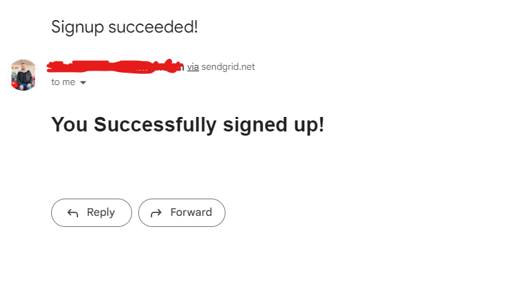
   <hr>
<h3 align='left'>Reset password email</h3>
   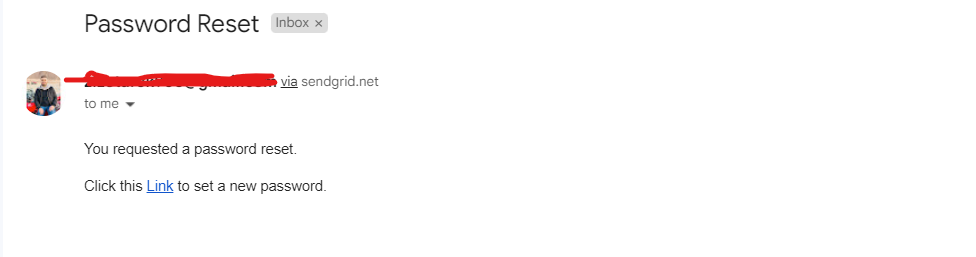
   <hr>
<h3 align='left'>Home Page</h3>
   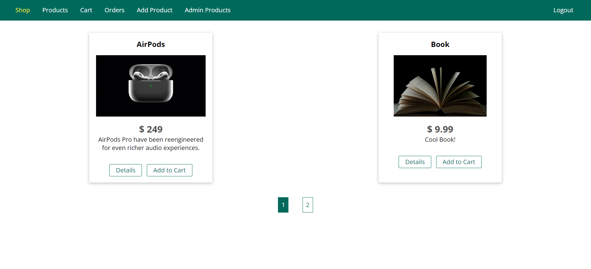
   <hr>
   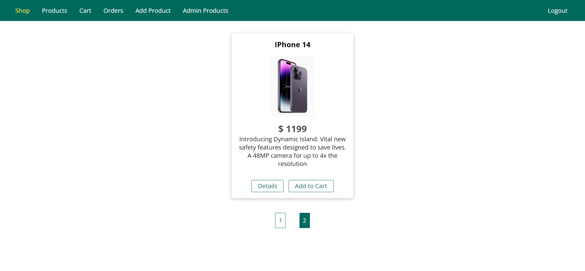
   <hr>
<h3 align='left'>Product Details</h3>
   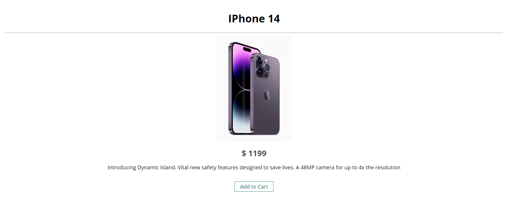
   <hr>
<h3 align='left'>User cart</h3>
   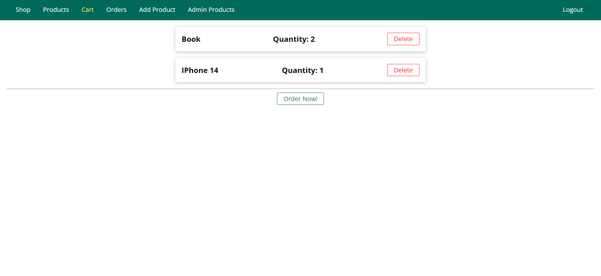</a>
   <hr>
<h3 align='left'>Confirm Order</h3>
   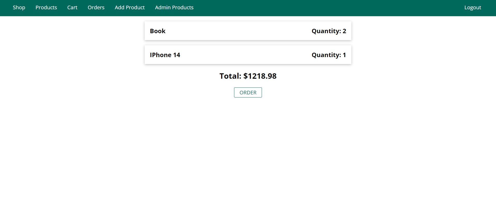</a>
   <hr>
<h3 align='left'>Payment</h3>
   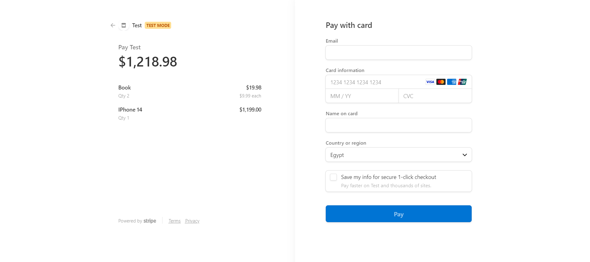</a>
   <hr>
<h3 align='left'>Payment Success</h3>
   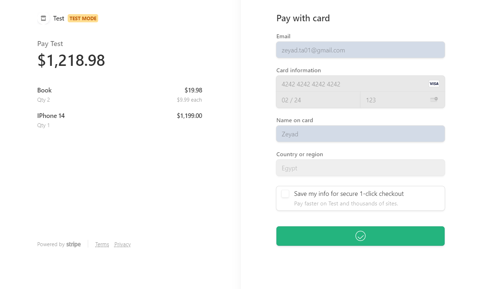</a>
   <hr>
<h3 align='left'>Orders</h3>
   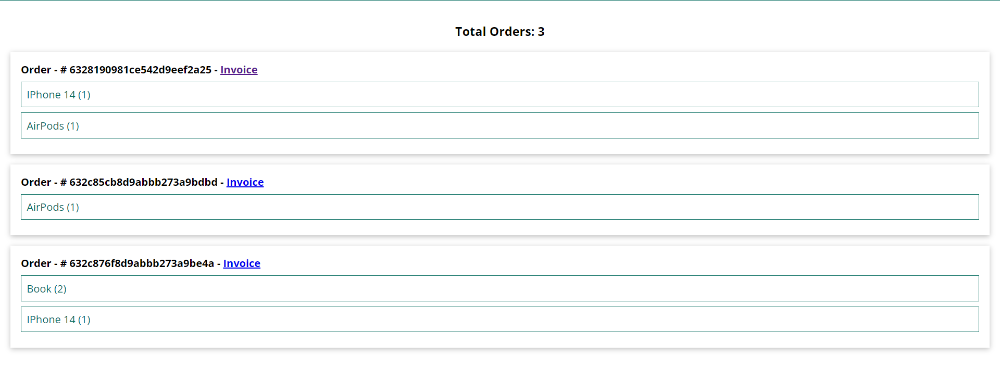</a>
   <hr>
<h3 align='left'>Generated Invoice</h3>
   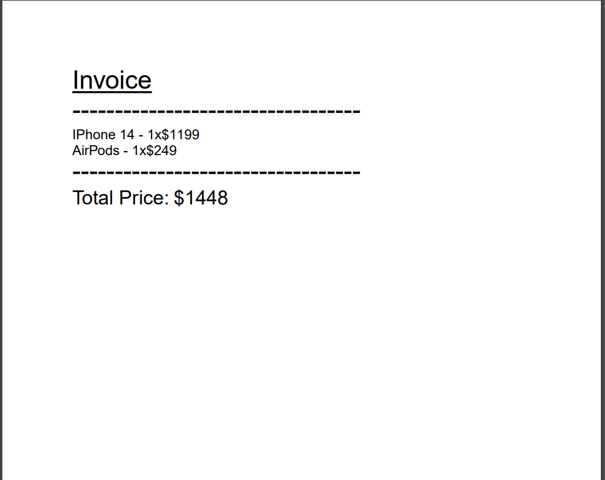</a>
   <h3 align='center'>You can see the generated PDF in data/invoices folder</h3>
   <hr>
<h3 align='left'>Admin Products</h3>
<h4 align='left'>Owner User</h4>
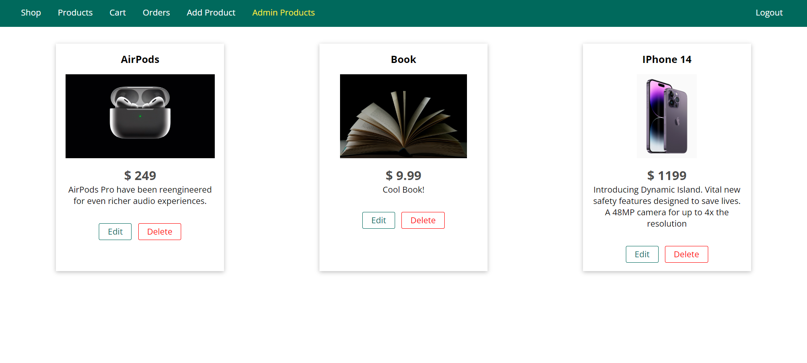</a>
<hr>
<h4 align='left'>Another User</h4>
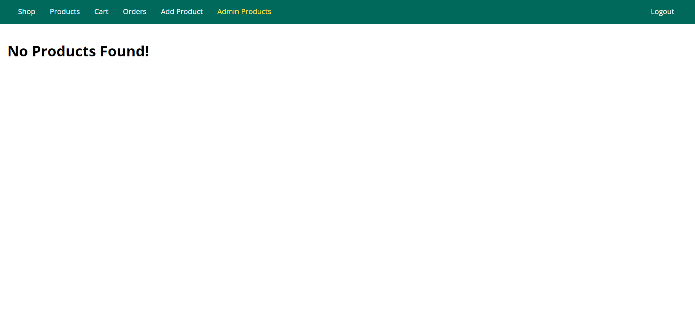</a>
<hr>
<h3 align='left'>Create Product</h3>
   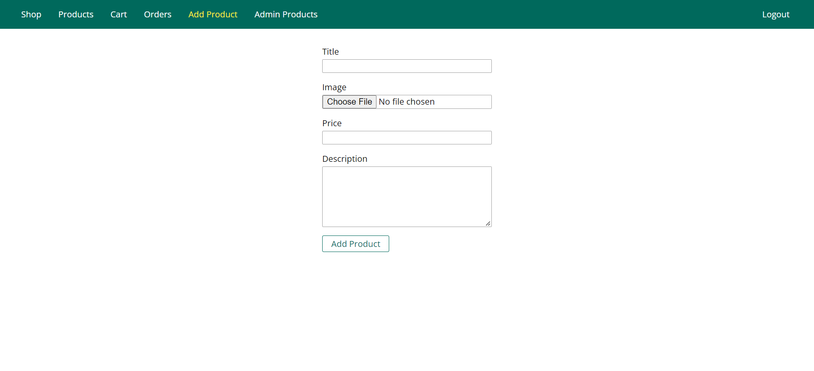</a>
   <hr>
<h3 align='left'>Edit Product</h3>
   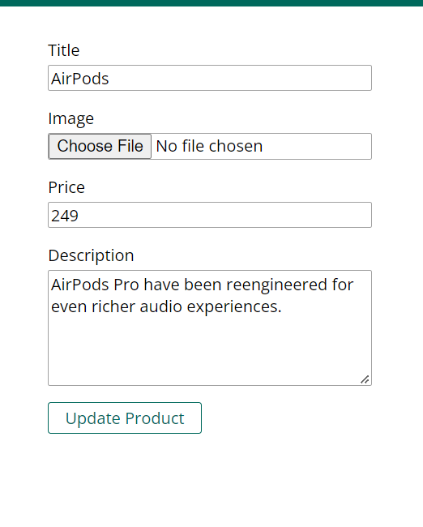</a>
   <hr>
<h3 align='left'>Reset password</h3>
   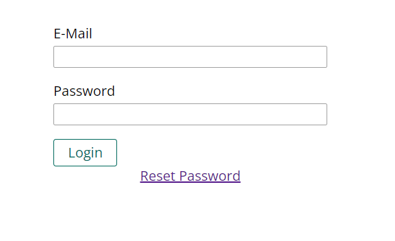</a>
   <hr>
   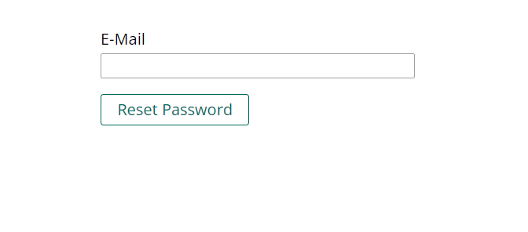</a>
   <hr>

</div>

## Contributors <a name = "Contributors"></a>

<table>
  <tr>
    <td align="center">
    <a href="https://github.com/ZeyadTarekk" target="_black">
    
    <br />
    <sub><b>Zeyad Tarek</b></sub></a>

  </tr>
 </table>

## License <a name = "license"></a>

> This software is licensed under MIT License, See [License](https://github.com/ZeyadTarekk/Mini-Amazon/blob/main/LICENSE) for more information.
